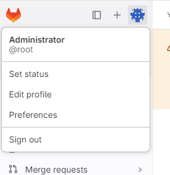

# 概要

## GitLabについて

GitLab Inc.社が開発するGitリポジトリマネージャー。
パブリックサービスである GitHub ライクなリポジトリマネージャーをローカルサイトで運用することができる。

コミュニティ版(CE:Community Edition)とエンタープライズ版(EE:Enterprise Edition)があります。

* CE版はMITライセンス、EE版は商用ライセンス。
* EE版をインストールした場合でも、CEに含まれる無料機能はすべて使用可能で、EEに含まれる有料機能を期間限定でお試し利用することができる。  
  お試し期間をすぎるとCE版機能のみを利用できるようになり、ライセンスを購入するとEE機能を利用できるようになる。
* [GitLabのドキュメント - 日本語](https://gitlab-docs.creationline.com/ee/index.html)

## ハードウェア要件

[GitLab installation minimum requirements – GitLab Docs](https://docs.gitlab.com/omnibus/installation/)より

* ストレージ（空き容量2.5 GB）
* CPU（推奨4コア、500ユーザー）
* メモリー（4GB RAM、500ユーザー）

# インストール

## 事前準備

* sshサーバは事前に設定しておくものとする。
* メール機能を用いる場合はSMTPの設定(Postfix etc)の設定は済ませておくものとする。

## 作業内容

必要なdebパッケージをインストールする。

```bash:terminal
sudo apt update
sudo apt install -y curl openssh-server ca-certificates tzdata perl
```

GitLabパッケージをインストールする。  
ここではGitLab CE（コミュニティエディション）をインストールする。

```bash:terminal
curl https://packages.gitlab.com/install/repositories/gitlab/gitlab-ce/script.deb.sh | sudo bash
sudo apt install -y gitlab-ce
```

設定を再構成して、起動する。

```bash:terminal
sudo gitlab-ctl reconfigure
```

設定と起動が終わったら、ログインのための初期パスワード確認する。

```bash:terminal
sudo cat /etc/gitlab/initial_root_password
```

以下の通り表示されるはずである。

```
# WARNING: This value is valid only in the following conditions
#          1. If provided manually (either via `GITLAB_ROOT_PASSWORD` environment variable or via `gitlab_rails['initial_root_password']` setting in `gitlab.rb`, it was provided before database was seeded for the first time (usually, the first reconfigure run).
#          2. Password hasn't been changed manually, either via UI or via command line.
#
#          If the password shown here doesn't work, you must reset the admin password following https://docs.gitlab.com/ee/security/reset_user_password.html#reset-your-root-password.

Password: abc123!abc123ABC123!abc123abc123ABC123!

# NOTE: This file will be automatically deleted in the first reconfigure run after 24 hours.
```

上記の場合、初期パスワードは`abc123!abc123ABC123!abc123abc123ABC123!`となる。

ブラウザより `http://<HOST_IP_ADDR>` にアクセスする。
(`<HOST_IP_ADDR>` はインストールしたサーバーのIPアドレス)

ログイン画面が表示されるので、ユーザ名に`root`、パスワードに先ほど確認した初期パスワードを入力し、"サインインする"をクリックすると、ログインが完了となる。


ここで、rootのパスワードの有効期限は24時間のため、パスワードを初期パスワードから変更する必要がある。  

左上アバターマークをクリックし、"Edit Profile" をクリックする。



左のペインの"Password"をクリックすると、パスワード変更画面が表示されるので、パスワードの変更を行う。

