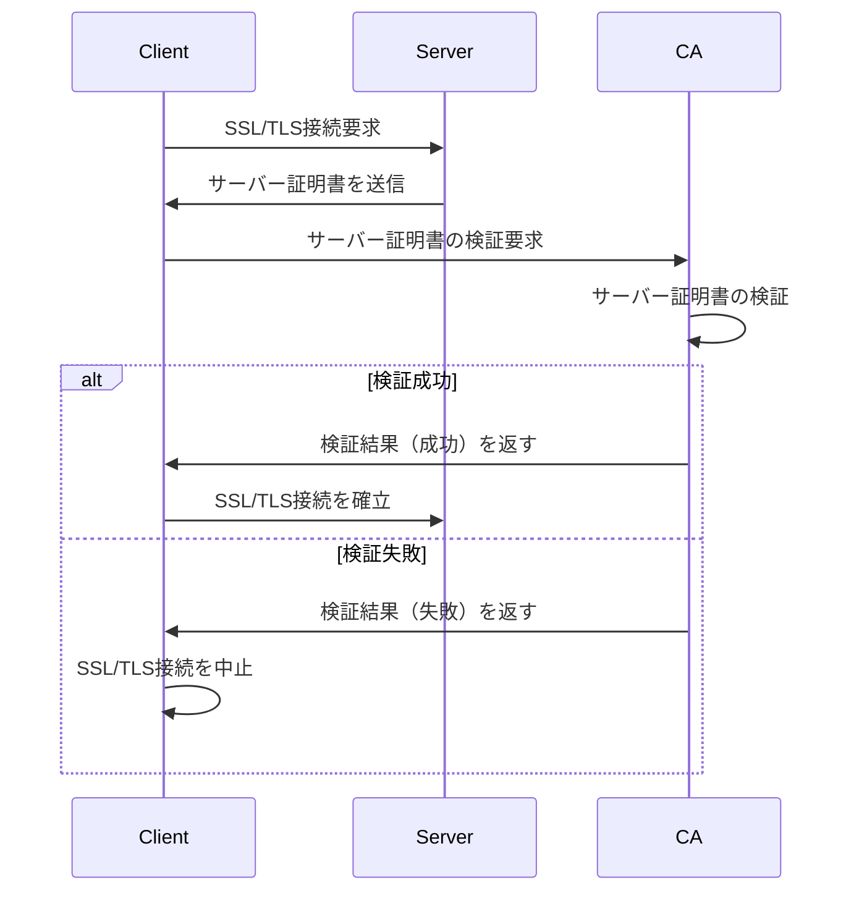

OpenSSLを使用して認証局 (CA; Certificate Authorities) を作成し、自己署名証明書を発行するオレオレ認証局（自分自身の認証局）を作成するための簡単な手順を説明する。  
ただし、これは教育や完全なローカル利用を目的とした場合のみ使用し、実際のシステムでは使用しないでください。

Ubuntu Server 22.04を仮定する。



## 必要なパッケージのインストール

```bash:terminal
sudo apt update
sudo apt install openssl
```


## ディレクトリの設定

認証局に必要なファイルやディレクトリを作成します。

```bash:terminal
mkdir -p ~/myCA/{certs,crl,newcerts,private}
mkdir -p ~/myCA/{certs,crl,newcerts,private}
cd ~/myCA
```

## CAの秘密鍵の生成

ここでは4096ビットのRSA秘密鍵を生成します。

```bash:terminal
openssl genpkey         \
  -algorithm RSA        \
  -out private/myCA.key \
  -aes256 4096
```

aes256オプションは鍵を暗号化するためのもので、パスフレーズの入力が求められます。


## CAの自己署名証明書の生成

次に、認証局の自己署名証明書を生成します。

```bash:terminal
openssl req              \
  -x509 -new -nodes      \
  -key private/myCA.key  \
  -sha256                \
  -days 3650             \
  -out certs/myCA.crt
```

ここで、様々な情報（国、都道府県、市区町村、組織名、共通名など）を入力します。共通名（CN）には認証局の名前を入力します。

## サーバー証明書の秘密鍵の生成

認証局を使用して署名するサーバー証明書の秘密鍵を生成します。

```bash:terminal
openssl genpkey  \
  -algorithm RSA \
  -out private/server.key  \
  -aes256
```

## サーバー証明書の署名要求（CSR）の生成

サーバー証明書の署名要求を生成します。

```bash:terminal
openssl req -new -key private/server.key -out server.csr
```

## サーバー証明書の発行

CAがCSRを使用してサーバー証明書を発行します。

```bash:terminal
openssl x509 -req -in server.csr -CA certs/myCA.crt -CAkey private/myCA.key -CAcreateserial -out certs/server.crt -days 365 -sha256
```

## 証明書の確認

発行された証明書を確認します。

```bash:terminal
openssl x509 -in certs/server.crt -text -noout
```

これで、オレオレ認証局によって発行された自己署名証明書を持つサーバー証明書が生成されました。  
認証局の証明書（myCA.crt）をクライアントにインストールすることで、このサーバー証明書を信頼できるようにします。

証明書をインストールする際は、使用するアプリケーションやサーバーの設定に応じて適切に配置してください。

